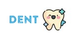

  

# django_mysite (Still in progress)
## Simple  website for a dental clinic.  

### Description
This page could serve for:

    -patients, to make an appointment, update it or delete,
    -doctors, to see/filter a list of patient`s appointment/s.

This project is focused mainly on the utilization of Django basics.

## Key features

- A patient can make an appointment with or without registration
- Appointment collision checker compares the particular appointment with the appointments in the database. If the checker finds a sameness, it automatically deletes the current appointment and allows to patient to create a new one.
- The appointment could be updated or deleted
- Logged in user has the ability to see his/her appointments on the profile page